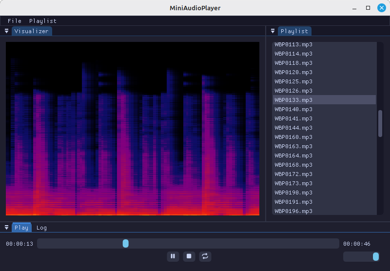

# MiniAudioPlayer
Example audio player using [MiniAudioExNET](https://github.com/japajoe/MiniAudioExNET).



# Features
- Play audio files by selecting them from a folder or open an entire directory.
- Loop audio.
- Shuffle playlist.
- Visualization using OpenGL shaders.

# How to shader
```glsl
// You can use these existing uniforms, don't declare them, this is just an example!
uniform sampler2D uTexture; //Texture of the previous frame
uniform sampler2D uAudio; //Texture containing PCM data in the red channel, FFT in the first half of the green channel
uniform vec2 uResolution; //The resolution
uniform float uTime; //The elapsed time

//Existing variants, don't declare, just use!
in vec2 TexCoords;
out vec4 FragColor;

void main() {
    // Do something fancy
    FragColor = vec4(1, 1, 1, 1);
}
```